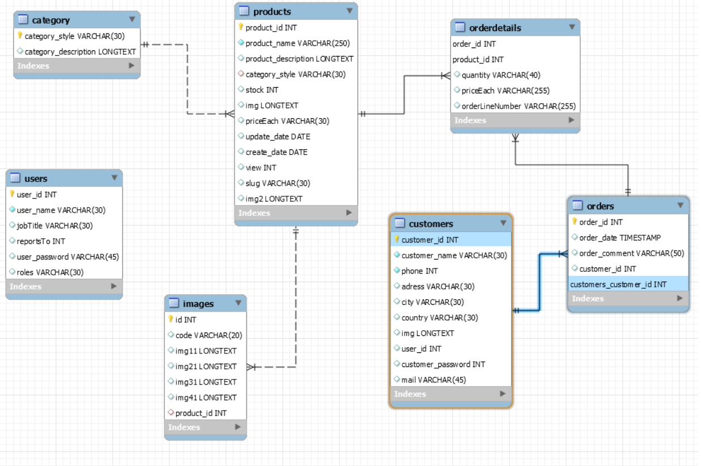

# GitProject
# CaseStudy: Shop bán giày DQ Sneakers
CHỦ ĐỀ : Một website và trang admin cùng database về một shop bán giày nam, nữ.
Các ngôn ngữ sử dụng:
- HTML, CSS, PHP, JS và Bootstrap4 để viết trang.
Các chức năng chính của dự án:
1. Database dữ liệu được lưu lại trên mysql workbench:
- Sẽ kết nối với trang Admin để chủ shop có thể thêm, sửa, xóa sản phẩm và xem doanh thu cũng như những order của khách hàng đặt online và đưa dữ liệu ngược về database.
- Sẽ kết nối với trang web chính bán hàng để khách hàng có thể xem, chọn sản phẩm và tạo đơn order về database và trang daskboard.
.
2. Trang quản lí daskboard để chủ shop và nhân viên cửa hàng có thể đăng nhập vào:
- Có phần login đăng nhập theo tài khoản được tạo trước, nhân viên sẽ chỉ được xem tồn kho sản phẩm và xử lí những order của khách, chỉ có tài khoản admin của chủ shop mới có thể thêm, sửa, xóa sản phẩm và tạo tài khoản nhân viên.
- Quản lí category, product, user, customers, ...
- Ngoài ra có thể phát triển thêm một vài tính năng như xem tồn kho, xác nhận đơn hàng của từng khách hàng, ...
3. Trang chủ nơi khách hàng xem sản phẩm:
- Nơi khách hàng có thể vào xem sản phẩm, xem thông tin của hàng, liên hệ với nhân viên, để lại thông tin, tạo đơn, chọn sản phẩm vào giỏ hàng và thêm, bớt sản phẩm ở đó.
- Gồm Navbar, Slidebar, top giày bán chạy, top giày mới về, các bài viết liên quan đến giày, footer, giỏ hàng, tìm kiếm, các trang chi tiết sản phẩm ...
- Trang chủ:
+Navbar.
+Sản phẩmlượt xem nhiều nhất.
+Sản phẩm mới.
+Sản phẩm bán chạy.
+Các nhóm hàng và bài viết liên quan.
+Footer
- Trang chi tiết sản phẩm:
+Navbar.
+Chi tiết sản phẩm, thêm vào giỏ hàng
+Các sản phẩm liên quan (cùng nhóm hàng)
+Footer
- Trang chi tiết sản phẩm hay nhóm hàng:
+Navbar.
+Chi tiết sản phẩm, thêm vào giỏ hàng
+Các sản phẩm liên quan (cùng nhóm hàng)
+Footer
- Trang tìm kiếm:
+Navbar.
+Có thanh tìm kiếm sản phẩm theo tên.
+Liệt kê tất cả sản phẩm theo phân trang (9 sản phẩm mỗi trang)
+Footer
- Giỏ hàng:
+Navbar.
+Bảng thông tin, số lượng, hình ảnh, tên, giá, tổng giá của các sản phẩm đã mua, có thể điều chỉnh lại số lượng.
+Nhập thông tin người dùng để đặt hàng.
+Footer
